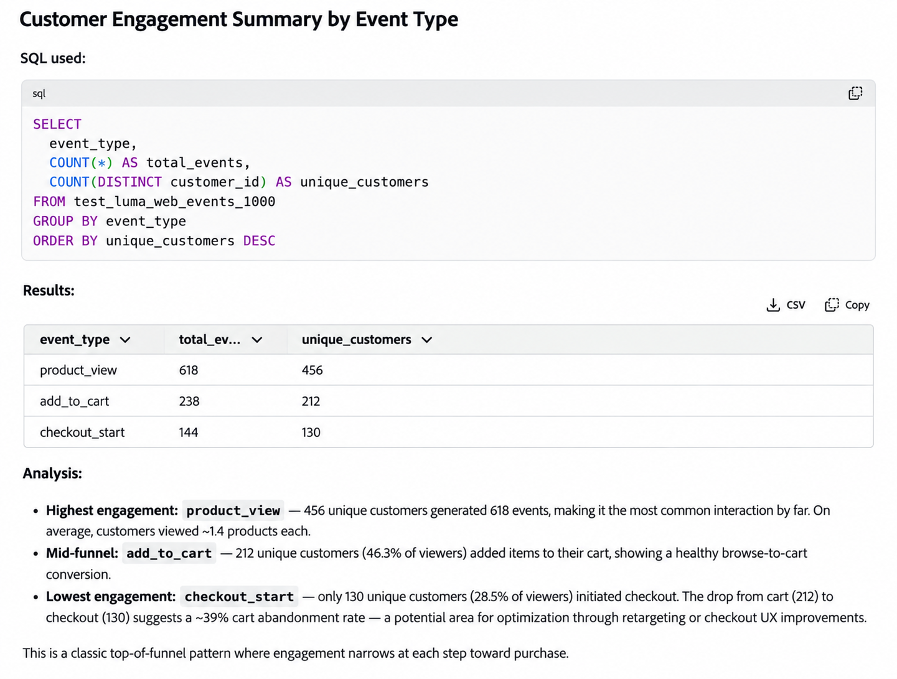

# Preparação de dados SQL no Co-worker

Use a Preparação de Dados SQL no Colaborador para executar tarefas comuns do [Data Distiller](https://experienceleague.adobe.com/en/docs/experience-platform/query/data-distiller/overview) com prompts em linguagem natural. Você pode gerar SQL, solucionar problemas ou otimizar uma consulta existente, visualizar resultados e agendar consultas para execução recorrente.

>[!AVAILABILITY]
>
>A Preparação de Dados SQL no Colaborador está disponível com Disponibilidade Limitada.

## Pré-requisitos {#prerequisites}

Antes de usar a Preparação de Dados SQL no Colaborador, verifique se você tem:

- Um direito ao Data Distiller.
- Acesso ao colaborador.

## Introdução {#get-started}

Para começar, abra o Colaborador e informe uma solicitação em linguagem natural que descreva a tarefa SQL ou o resultado que você deseja atingir.

Você pode identificar os conjuntos de dados que deseja usar em sua solicitação. Se forem necessárias informações adicionais para concluir a tarefa, o Colaborador poderá fazer perguntas de acompanhamento antes de continuar.

Depois que o Colaborador gerar ou atualizar o SQL, você poderá continuar a conversa para visualizar os resultados, refinar a consulta, salvá-la ou agendá-la para execução recorrente.

Para obter orientação sobre como usar a interface do Colaborador, consulte o [Guia da Interface do Colaborador](../coworker/chat/ui-guide.md).

## Recursos compatíveis {#supported-capabilities}

Você pode usar a Preparação de Dados SQL para as seguintes tarefas:

| Recurso | Descrição |
| --- | --- |
| **Criação de SQL** | Gerar SQL a partir de uma descrição em linguagem natural da operação de dados que você deseja executar. |
| **Otimização SQL** | Analise uma consulta existente do Data Distiller e otimize-a para obter desempenho, preservando os resultados desejados. |
| **Diagnóstico e correção de erros SQL** | Diagnosticar erros em uma consulta SQL existente, explicar a causa raiz e gerar o SQL corrigido. |
| **Agendamento e alertas de consulta** | Salve e programe consultas para execução recorrente e configure alertas de consulta compatíveis. |

## Usar Preparação de Dados SQL em uma conversa {#work-with-sql-data-preparation}

Você pode combinar recursos de Preparação de Dados SQL na mesma conversa de Colaborador, em vez de tratá-los como workflows separados.

Por exemplo, você pode:

1. Descreva o resultado desejado e gere o SQL.
2. Visualize até cinco linhas de resultados da consulta.
3. Refine a query ou faça perguntas sobre o SQL gerado.
4. Salve a consulta.
5. Programe a consulta para execução recorrente e configure alertas.

O colaborador pode fazer perguntas de acompanhamento quando informações adicionais são necessárias, como identificar o conjunto de dados apropriado ou confirmar o fuso horário de um agendamento.

Uma pré-visualização de consulta retorna até cinco linhas. Para executar e trabalhar com consultas diretamente no Experience Platform, consulte o [Guia da interface do Editor de Consultas](https://experienceleague.adobe.com/en/docs/experience-platform/query/ui/user-guide).


### Gerar SQL a partir da linguagem natural {#generate-sql}

Use a criação de SQL quando você souber o resultado ou a transformação que deseja obter, mas quiser que o Co-worker gere o SQL correspondente.

Para gerar o SQL a partir dos dados corretos, o Co-worker pode identificar e validar os conjuntos de dados envolvidos. Se sua solicitação não fornecer informações suficientes para identificar o conjunto de dados apropriado, o Colaborador poderá fazer perguntas de acompanhamento antes de continuar.

Por exemplo:

> Olá! Usando test_luma_web_events_1000, resuma o engajamento do cliente por tipo de evento. Mostrar o tipo de evento, o total de eventos e os clientes únicos. Retorne uma linha por tipo de evento e classifique os resultados por clientes únicos do mais alto para o mais baixo.

O colaborador retorna o SQL gerado e pode executar a consulta para fornecer uma visualização dos resultados.



Para obter informações sobre como criar e executar consultas diretamente no Experience Platform, consulte o [Guia da interface do Editor de Consultas](https://experienceleague.adobe.com/en/docs/experience-platform/query/ui/user-guide).

### Otimizar SQL existente {#optimize-sql}

Use a otimização SQL quando você já tiver uma consulta do Data Distiller e quiser melhorar seu desempenho sem alterar os resultados desejados.

Você pode pedir ao Colaborador para explicar as alterações, comparar o SQL original e otimizado e fornecer informações de validação ou de plano de consulta.

Por exemplo:

> Otimize a seguinte query para obter o desempenho do Data Distiller, preservando exatamente os mesmos resultados. Explique o que você alterou e por que a consulta otimizada é logicamente equivalente.
>
> ```sql
> SELECT
>         p.customer_id,
>         p.first_name,
>         p.last_name,
>         p.loyalty_status,
>         COUNT(o.order_id) AS total_orders,
>         SUM(CAST(o.order_total AS DOUBLE)) AS total_revenue
> FROM test_luma_profiles_1000 p
> INNER JOIN test_luma_orders_1000 o
>         ON p.customer_id = o.customer_id
> GROUP BY
>         p.customer_id,
>         p.first_name,
>         p.last_name,
>         p.loyalty_status
> ORDER BY total_revenue DESC;
> ```
>
> Envie-me a resposta completa, especialmente o SQL original, o SQL otimizado, a explicação de equivalência e quaisquer resultados EXPLICAR/validação.

Se a consulta fornecida já estiver otimizada, o Colaborador poderá determinar que nenhuma modificação é necessária e explicar sua avaliação.


O SQL gerado pelo recurso de criação do SQL já está otimizado. Não é necessário enviar o SQL recém-gerado separadamente para otimização.

Para obter a sintaxe SQL e os comandos com suporte, consulte a [Referência SQL do Serviço de Consulta](https://experienceleague.adobe.com/en/docs/experience-platform/query/sql/overview).

### Diagnosticar e corrigir erros SQL {#diagnose-sql-errors}

Use o diagnóstico de erro SQL quando uma consulta existente falhar e você precisar de ajuda para identificar a causa e corrigir o SQL.

O colaborador analisa o query, identifica a causa do erro, explica o problema e fornece o SQL corrigido.

Por exemplo:

> Oi! A consulta a seguir está falhando. Diagnostique o erro, explique a causa raiz e forneça uma consulta corrigida:
>
> ```sql
> SELECT
>         o.order_id,
>         o.product_id,
>         p.product_name,
>         o.order_total
> FROM test_luma_orders_1000 o
> JOIN test_luma_product_catalog_1000 p
>         ON o.productid = p.productid;
> ```
>
> A consulta corrigida deve usar os campos de ID do produto apropriados de ambos os conjuntos de dados.

Depois de corrigir a consulta, você pode pedir ao Co-worker para executá-la e visualizar os resultados.


### Agendar consultas e configurar alertas {#schedule-queries}

Depois de gerar, corrigir ou visualizar uma consulta, você pode continuar a conversa para salvá-la e agendá-la para execução recorrente.

Por exemplo:

> Agende essa consulta para ser executada todos os dias às 6h. Configure um alerta se o query falhar.

Se as informações necessárias estiverem ausentes ou forem ambíguas, o Colaborador fará perguntas complementares antes de criar o agendamento. Por exemplo, ele pode solicitar que você confirme o fuso horário associado a um tempo de execução solicitado.

Depois que você confirmar os detalhes de agendamento necessários, o Colaborador retorna um resumo do modelo de consulta salvo, do agendamento, do fuso horário, do status e do alerta de falha.


Para obter informações detalhadas sobre agendamentos de consulta, configurações de recorrência, conjuntos de dados de saída e alertas, consulte [Agendamentos de consulta](https://experienceleague.adobe.com/en/docs/experience-platform/query/ui/query-schedules).

## Próximas etapas {#next-steps}

Para obter mais informações sobre os recursos do Data Distiller e do Serviço de consulta usados pela Preparação de dados SQL, consulte a seguinte documentação:

- [Visão geral do Data Distiller](https://experienceleague.adobe.com/en/docs/experience-platform/query/data-distiller/overview)
- [Guia da interface do Editor de consultas](https://experienceleague.adobe.com/en/docs/experience-platform/query/ui/user-guide)
- [Agendamentos de consulta](https://experienceleague.adobe.com/en/docs/experience-platform/query/ui/query-schedules)
- [Referência SQL do serviço de consulta](https://experienceleague.adobe.com/en/docs/experience-platform/query/sql/overview)
