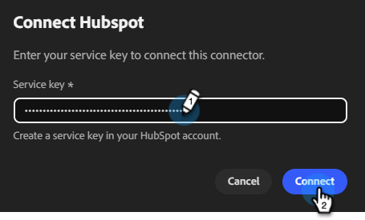

# Conectar-se ao HubSpot {#hubspot}

O Adobe Co-worker Campaigns permite que você conecte sua conta HubSpot para obter listas de contatos.

>[!PREREQUISITES]
>
>Para usar esse conector, primeiro você deve ter:
>
>* Uma conta HubSpot ativa
>* Uma [chave de serviço](https://developers.hubspot.com/docs/apps/developer-platform/build-apps/authentication/account-service-keys#create-a-service-key) criada com os seguintes escopos adicionados: `crm.objects.contacts.read`, `crm.objects.leads.read`, `crm.schemas.contacts.read`, `crm.lists.read`, `crm.export`

## Como se conectar

1. Na [página inicial de Campanhas do colega de trabalho](https://coworker-campaigns.experience.adobe.com/), clique em **Personalizar** e selecione **Conectores**.

   

1. Clique em **Adicionar integração**.

   

   >[!NOTE]
   >
   >Se essa não for a primeira integração, o botão exibirá &quot;Adicionar conector&quot;.

1. Na linha HubSpot, clique em **Conectar**.

   

1. Um modal é exibido mostrando as permissões necessárias (listadas nos Pré-requisitos na parte superior deste artigo). Clique em **Continuar**.

1. Insira sua **Chave de serviço** do HubSpot e clique em **Conectar**.

   

Após a conexão, o HubSpot aparece na lista de Conectores e pode ser selecionado ao vincular uma lista de contatos para sincronização a partir do HubSpot.

**Para desconectar:**

1. Na tela Conectores, encontre o bloco HubSpot e clique em **Gerenciar**.

   

1. Clique em **Desconectar** (não é necessário inserir novamente sua chave de serviço neste momento).

   

1. Clique novamente em **Desconectar** para confirmar.

   
