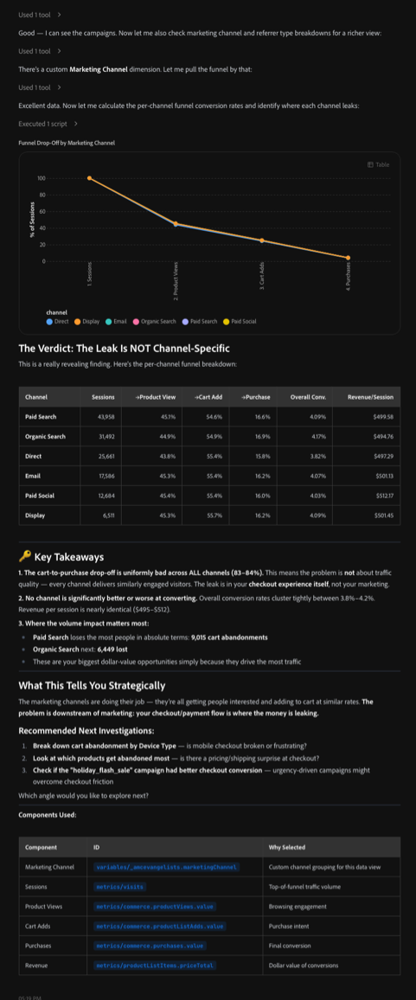

# Analisar dados do Customer Journey Analytics com o Chat do parceiro

O Adobe CX Enterprise Co-worker Chat pode executar análises avançadas de dados que anteriormente eram possíveis somente no Analysis Workspace. O Bate-papo com colegas de trabalho acessa os dados das visualizações de dados do Customer Journey Analytics, permitindo que você explore esses dados e obtenha respostas para prompts em linguagem natural.

Antes de começar a análise, saiba mais sobre a interface do Coworker Chat e as opções de configuração e, em seguida, verifique se o Coworker está conectado ao Customer Journey Analytics e à visualização de dados que contém os dados que você deseja usar.

## Introdução ao Chat do Colaborador

### Opções de interface e configuração

Antes de usar o Co-worker Chat com seus dados do Customer Journey Analytics, saiba como fazer logon e gerenciar as opções de configuração para os seguintes recursos:

* Entradas de chat
* Conversas
* Marketplaces
* Servidores MCP
* Memória
* Plug-ins
* Habilidades
* E muito mais

Para obter mais informações, consulte o [Guia de Interface de Chat do Colaborador](./).

### Casos de uso do Customer Journey Analytics

Você pode ver casos de uso da Customer Journey Analytics e exemplos de prompts que os profissionais estão usando no Adobe CX Enterprise Coworker Chat. Cada prompt é criado para ser copiado, adaptado com seus próprios dados e contexto e refinado através da conversa.

Para obter mais informações, consulte [Casos de uso](./).

## Verifique se o Chat do colaborador está conectado ao Customer Journey Analytics

1. No Chat do colaborador, verifique se o colaborador está conectado ao Customer Journey Analytics.

1. Selecione o ícone MCP no painel à esquerda e verifique se [!UICONTROL **cja-mcp**] está disponível na lista de servidores MCP conectados.

   

1. (Condicional) Se o [!UICONTROL **cja-mcp**] ainda não estiver conectado, selecione [!UICONTROL **Adicionar Servidor MCP**], especifique o cja no campo [!UICONTROL **Nome do Servidor**] e selecione-o quando ele aparecer e selecione [!UICONTROL **Adicionar Servidor**].

## Conectar à visualização de dados direita

Uma visualização de dados é um container no Customer Journey Analytics que determina como os dados são interpretados.

Você pode ter acesso a várias visualizações de dados no Customer Journey Analytics, cada uma contendo diferentes dimensões e métricas que o Colaborador pode usar ao analisar dados.

### Decida quais visualizações de dados você deseja usar

Informe ao Coworker os tipos de perguntas que você deseja responder e pergunte a qual visualização de dados você tem acesso que seria melhor fornecer essas informações. Você também pode [definir sua visualização de dados como uma preferência na memória](#add-a-data-view-preference-in-memory).

**Você:**

>[!BEGINSHADEBOX]

Estou interessado em saber onde os clientes chegam na jornada do cliente. A quais visualizações de dados no Customer Journey Analytics tenho acesso que poderiam responder a essa pergunta para mim?

>[!ENDSHADEBOX]

**Resposta do Chat de Colaborador:**

>[!BEGINSHADEBOX]

Você tem acesso a três visualizações de dados. A visualização de dados do `Customer lifecycle` contém as seguintes dimensões e métricas, que seriam as melhores para responder à sua pergunta.

>[!ENDSHADEBOX]

**Você:**

>[!BEGINSHADEBOX]

Ótimo, vamos usar essa visualização de dados.

>[!ENDSHADEBOX]

**Resposta do Chat de Colaborador:**

>[!BEGINSHADEBOX]

OK, usarei a visualização de dados `Customer lifecycle` para responder a perguntas futuras nesta sessão de chat.

>[!ENDSHADEBOX]

### Adicionar uma preferência de visualização de dados na memória

O Chat do Colaborador contém um recurso de memória que permite fornecer a ele acesso a informações que se estendem por todos os chats. É uma boa prática adicionar suas visualizações de dados preferidas como preferências na memória do Colaborador.

1. No Bate-papo com colega, na navegação à esquerda, selecione o ícone Memória.

1. Na página Memória, na seção Preferências armazenadas, especifique uma ou mais visualizações de dados que você deseja que o Bate-papo de Colaborador use em seus chats.

   

## Analisar no Customer Journey Analytics

Depois que o Colaborador cria uma visualização, você pode abri-la no Analysis Workspace no Customer Journey Analytics para uma análise mais profunda com controle mais granular. A visualização é aberta em um novo projeto do Analysis Workspace no Customer Journey Analytics.

Para abrir uma visualização em um novo projeto do Analysis Workspace:

1. Selecione [!UICONTROL **Analisar no CJA**] ao lado de qualquer visualização criada no Co-worker.

1. Com a visualização aberta no Customer Journey Analytics, você pode usar a interface de navegador de arrastar e soltar do Analysis Workspace para fazer modificações, criar ainda mais sua análise, criar um público-alvo e muito mais. Você pode até mesmo compartilhar seu projeto do Workspace com qualquer pessoa que escolher.

   Para obter mais informações sobre o Analysis Workspace, consulte [visão geral do Analysis Workspace](https://experienceleague.adobe.com/pt-br/docs/analytics-platform/using/cja-workspace/home).

## Exemplo: descobrir onde os clientes chegam

Você pode pedir ao Bate-papo com colegas de trabalho que use seus dados para analisar qualquer questão comercial.

Por exemplo, como gerente de marketing, comerciante ou líder de crescimento, você pode querer entender onde os clientes abandonam o caminho para comprar, por que fizeram e o que pode ser feito para impulsionar taxas de conversão mais altas.

>[!NOTE]
>
>As figuras abaixo são dados de exemplo ilustrativos para uma retailer fictícia, [!DNL TechPulse Electronics], usada para mostrar a forma da conversa.

### Os tipos de perguntas que você pode fazer

Você não precisa saber o que é uma &quot;visualização de fallout&quot; ou qual métrica vai para qual slot. Em vez disso, descreva o resultado importante em linguagem simples:

* &quot;Onde estamos perdendo pessoas a caminho de comprar?&quot;
* &quot;Qual é o meu funnel de conversão completa, desde a visualização do produto até o check-out?&quot;
* &quot;Quais canais de marketing mais vazam entre o carrinho e a compra?&quot;
* &quot;O abandono do carrinho é pior em dispositivos móveis ou em desktops?&quot;
* &quot;As pessoas de redes sociais pagas convertem-se de forma diferente das pessoas de e-mail?&quot;

### A conversa

#### &#x200B;1. Comece com a pergunta comercial

**Você:**

>[!BEGINSHADEBOX]

Onde estamos perdendo pessoas a caminho de comprar?

>[!ENDSHADEBOX]

**Resposta do Chat de Colaborador:**

Observe que o Bate-papo com colegas de trabalho escolhe a visualização correta, faz a sequência dos pontos de contato e até adiciona as próximas etapas recomendadas.

>[!BEGINSHADEBOX]

Esta é uma pergunta sobre o funnel — deixe-me executar o funnel de conversão para ver onde a entrega acontece no caminho da compra.

Aqui é onde você está perdendo pessoas:

| Etapa do funnel | Count | Conversão para o próximo | Drop-off |
| --- | --- | --- | --- |
| Sessions | 137,476 | 45% visualizam um produto | 55% de licenças sem navegar pelos produtos |
| Visualizações de produto | 61,845 | 55,0% de acréscimo ao carrinho | 45% navegam, mas não adicionam |
| Adições ao carrinho | 34,045 | 16,4% de compra | 83,6% abandonam o carrinho |
| Compras | 5,582 | — | — |

**A grande descoberta: o carrinho que você vai comprar é o seu maior vazamento**

28.463 pessoas adicionam itens ao carrinho, mas nunca concluem a compra. Essa é uma taxa de devolução de 83,6% do carrinho até a compra — de longe o maior ponto único de falha.

**O que isso informa sobre as prioridades:**

| Prioridade | Problema | Escala de oportunidade |
| --- | --- | --- |
| #1 | Abandono de carrinho para compra (queda de 83,6%) | 28.463 compradores perdidos |
| #2 | Sessão para visualização do produto (55% nunca navegam) | 75.631 sessões sem envolvimento com o produto |
| #3 | Exibição do produto ao carrinho (45% não adicionam) | 27.800 interessados, mas não comprometidos |

**Próximas etapas recomendadas:**

1. Detalhar o abandono do carrinho por canal de marketing: alguns canais estão trazendo tráfego de baixa intenção que aumenta o carrinho, mas nunca compra?
1. Observe o abandono do carrinho por tipo de dispositivo. O atrito do checkout móvel está matando as conversões?
1. Identifique quais produtos são mais abandonados — problema de preço? Surpresa no transporte?

**Quais destes itens você deseja que eu descubra a seguir?** O detalhamento do canal informaria diretamente quais ações de marketing estão trazendo a você &quot;quase compradores&quot; versus compradores reais.

>[!ENDSHADEBOX]

#### &#x200B;2. Perfurar o vazamento

**Você:**

>[!BEGINSHADEBOX]

Ok, vamos detalhar por canal de marketing

>[!ENDSHADEBOX]

**Resposta do Chat de Colaborador:**

>[!BEGINSHADEBOX]

Há uma dimensão personalizada de **Canal de marketing**. Deixem-me analisar a funnel e calcular as taxas de conversão por canal e identificar onde cada canal vaza.

**O veredicto: o vazamento não é específico do canal**

Esta é uma descoberta realmente reveladora. Este é o detalhamento do funnel por canal:

| Canal | Sessions | Para exibição do produto | Para adicionar carrinho | Para comprar | Conversão geral | Receita/sessão |
| --- | --- | --- | --- | --- | --- | --- |
| Pesquisa paga | 43,958 | 45.1% | 54.6% | 16.6% | 4.09% | $499.58 |
| Pesquisa orgânica | 31,492 | 44.9% | 54.9% | 16.9% | 4.17% | $494.76 |
| Direto | 25,245 | 43.6% | 55.4% | 15.8% | 3.82% | $497.29 |
| Email | 17,586 | 45.3% | 55.4% | 16.2% | 4.07% | $501.13 |
| Social pago | 12,684 | 45.4% | 55.7% | 16.0% | 4.03% | $512.17 |
| Exibir | 6,511 | 45.3% | 55.7% | 16.2% | 4.09% | $501.45 |

**Principais argumentos:**

1. A devolução do carrinho para compra é uniformemente incorreta em todos os canais (83-84%). Isso significa que o problema não está na qualidade do tráfego — cada canal está convertendo pessoas no carrinho a taxas semelhantes. O vazamento está na sua experiência de finalização em si, não no marketing.
1. Nenhum canal é significativamente melhor ou pior na conversão. As taxas de conversão gerais se agrupam perfeitamente entre 3,8% e 4,2%, e a receita por sessão é quase idêntica (US$ 495 a US$ 512).
1. Onde o impacto no volume é mais importante: a pesquisa paga perde mais pessoas em termos absolutos (9.015 abandonos de carrinho), seguida pela pesquisa orgânica (6.449 perdidos). Estas são as maiores oportunidades em valores de dólar porque elas geram mais tráfego.

**O que isso lhe diz estrategicamente**

Os canais de marketing estão fazendo seu trabalho — todos estão deixando as pessoas interessadas e adicionando ao carrinho em taxas semelhantes. O problema é downstream de marketing: seu checkout e fluxo de pagamento é onde o dinheiro está vazando.

**Próximas investigações recomendadas:**

1. Detalhar o abandono do carrinho móvel por categoria de produto — é pior para itens de alto preço (sugerindo problemas de confiança de pagamento móvel)?
1. Veja quais canais de marketing direcionam mais tráfego móvel: você está gastando dinheiro pago em mídia para enviar pessoas para uma funnel móvel quebrada?
1. Verifique se há um sinal de página ou seção do site. Podemos ver quais páginas de check-out os usuários móveis acessaram por último antes de abandonar?

**Que ângulo você gostaria de explorar a seguir?**

>[!ENDSHADEBOX]

#### &#x200B;3. Continuar investigando

**Você:**

>[!BEGINSHADEBOX]

Interessante. Vamos tentar detalhar por tipo de dispositivo.

>[!ENDSHADEBOX]

**Resposta do Chat de Colaborador:**

>[!BEGINSHADEBOX]

**Encontrado: o check-out móvel foi desfeito**

O funnel é idêntico em todos os dispositivos até o check-out — depois, o dispositivo móvel cai de um penhasco:

| Dispositivo | Sessions | Para exibição do produto | Para adicionar carrinho | Para comprar | Conversão geral |
| --- | --- | --- | --- | --- | --- |
| Desktop | 70,172 | 44.9% | 54.8% | 23.2% | 5.70% |
| Tablet | 13,855 | 44.7% | 55.6% | 14.3% | 3.56% |
| Dispositivo móvel | 53,449 | 44.9% | 55.3% | 8.1% | 2.02% |

**A arma do cigarro**

| Métrica | Desktop | Dispositivo móvel | Lacuna |
| --- | --- | --- | --- |
| Taxa de compra do carrinho | 23.2% | 8.1% | 15 pontos percentuais |
| O dispositivo móvel é | — | 2,8x pior | — |
| Carrinhos abandonados | 13,274 | 12,178 | Quase o mesmo volume absoluto |

A experiência de navegação e de adição ao carrinho é boa em dispositivos móveis (taxa de navegação idêntica a ~45%, ~55% de taxa de adição ao carrinho). As pessoas estão igualmente interessadas e engajadas. Mas algo no fluxo de check-out móvel está matando as conversões.

**A oportunidade de receita**

Se o checkout móvel fosse convertido à mesma taxa do desktop, você ganharia ~1.991 compras adicionais — um aumento de 35% no volume total de compras com a correção de uma experiência.

**O que provavelmente está acontecendo**

O padrão de dados (engajamento igual, queda de check-out catastrófica) é um sinal clássico para:

* O atrito do formulário de pagamento em telas pequenas (problemas de preenchimento automático, layout de formulário)
* Custos inesperados revelados no checkout (envio, impostos) causando choque no adesivo
* Check-out de convidado não disponível ou um mural de logon em dispositivos móveis
* Problemas de carregamento de página ou tempo limite durante o processamento de pagamento em dispositivos móveis

**Próximas etapas recomendadas:**

1. Detalhar o abandono do carrinho móvel por categoria de produto — é pior para itens de alto preço (sugerindo problemas de confiança de pagamento móvel)?
1. Veja quais canais de marketing direcionam mais tráfego móvel: você está gastando dinheiro pago em mídia para enviar pessoas para uma funnel móvel quebrada?
1. Verifique se a campanha &quot;Holiday_flash_sale&quot; teve uma conversão melhor do checkout: campanhas orientadas por urgência podem superar o atrito do checkout

**Qual você gostaria de explorar ou esta evidência é suficiente para levar para sua equipe de UX e check-out?**

>[!ENDSHADEBOX]

#### &#x200B;4. Transforme em uma decisão

**Você:**

>[!BEGINSHADEBOX]

Então, o que devo fazer?

>[!ENDSHADEBOX]

**Resposta do Chat de Colaborador:**

>[!BEGINSHADEBOX]

Com base no que os dados mostram, é aqui que eu me concentrarei:

* **Corrija o check-out móvel — não é um problema de canal.** Cada canal está convertendo pessoas no carrinho em uma taxa semelhante e saudável, então o gasto com anúncios está funcionando em todos os sentidos. A receita está sendo perdida especificamente no fluxo de check-out móvel, que é o lugar da correção.
* **Comece com pagamento e fricção de formulário.** Essas são as razões mais comuns para os compradores de dispositivos móveis de alta intenção abandonarem um carrinho. Oferecer opções de carteira móvel e encurtar o formulário geralmente são os ganhos mais rápidos.
* **Verificar novamente após a correção.** Depois que as alterações no checkout forem enviadas, observe se a taxa de carrinho-para-compra dos dispositivos móveis se move em direção à taxa de desktop de 23,2%.

Quer que eu salve como um projeto para que você possa rastreá-lo ou definir um alerta se o carrinho de compras de dispositivos móveis ficar abaixo de um limite?

>[!ENDSHADEBOX]

### O que aconteceu

Em quatro perguntas simples, Coworker nos ajudou a:

* Crie um funnel de conversão de várias etapas e sinalize o carrinho de compras como o maior vazamento
* Exclua o canal de marketing como causa — cada canal vazou quase na mesma taxa
* Isole o problema real para a finalização móvel e quantifique a correção em um aumento de 35% nas compras
* Saia com uma correção específica para priorizar: pagamento móvel e atrito de formulários. Isso é comparado com a taxa de conversão de 23,2% do desktop
