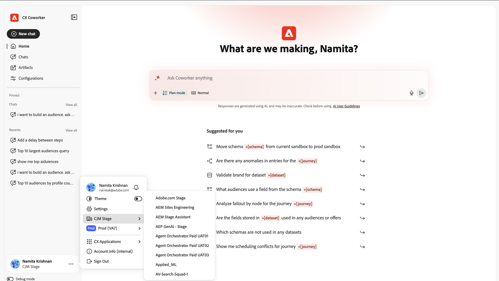
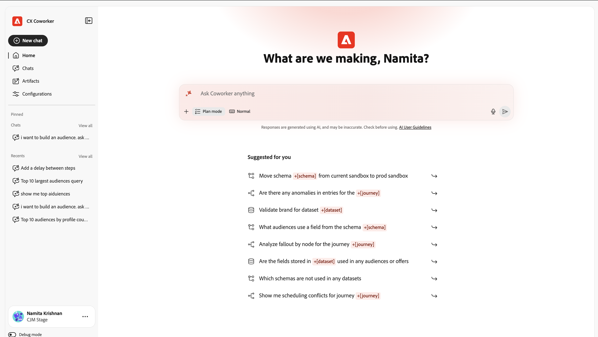

# Guia da interface do usuário {#ui-guide}

Orientar-se com a interface de bate-papo de colega de trabalho. Este guia aborda tudo, desde acessar o aplicativo e navegar pelo espaço de trabalho até aproveitar ao máximo as conversas, gerenciar seu histórico e adaptar sua configuração.

>[!VIDEO](https://video.tv.adobe.com/v/3498571?captions=por_br&learn=on)

## Acessar o bate-papo do colega

Acesse o Chat do Colaborador navegando até [https://experience.adobe.com/#/coworker](https://experience.adobe.com/#/coworker) e entrando com suas credenciais da Adobe.

Você também pode acessá-lo selecionando **Colaborador** no seletor de aplicativos no cabeçalho superior do CX Enterprise.

## Escolha sua organização e sandbox

O contexto atual é mostrado na parte inferior do painel de navegação esquerdo, sob seu nome e imagem de perfil. O contexto determina quais dados, habilidades e ferramentas conectadas uma conversa pode acessar, portanto, confirme-os antes de começar.

Selecione seu nome para abrir o menu de conta, onde você pode alternar o contexto e alterar as configurações do espaço de trabalho:

| Elemento da interface | Descrição |
| --- | --- |
| Tema | Desloque o tema da interface entre Claro e Escuro. |
| Configurações | Abra as configurações do espaço de trabalho para ver detalhes sobre sua conta e outras configurações. |
| Seletor de organização | Alternar as execuções do Colaborador da Organização IMS. |
| Seletor de sandbox | Alternar a sandbox ativa do AEP. |
| Aplicativos CX | Vá para outro aplicativo CX Enterprise conectado à sua conta. |
| Fazer logoff | Saia da sua conta da Adobe. |

## Navegue pela interface

A interface do CX Co-worker tem duas áreas principais: o painel de navegação à esquerda e a tela de conversação que preenche o restante da janela.

## O painel de navegação

O painel oferece acesso a todas as partes do produto e ao seu trabalho recente.

| Elemento da interface | Descrição |
| --- | --- |
| Novo bate-papo | Inicie uma nova conversa. Seu chat atual foi salvo no histórico. |
| Início | Retorne à saudação, caixa de entrada e prompts sugeridos. |
| Chats | Abra o histórico completo do chat para pesquisar, fixar, arquivar ou excluir conversas. |
| Configurações | Gerenciar habilidades, servidores MCP, Marketplaces, plug-ins e memória. |
| Fixado | Conversas que você estrelou, mantidas no topo para acesso rápido. Selecione Exibir todos para vê-los na página de Bate-papos. |
| Recentes | Suas conversas mais recentes. Selecione Exibir tudo para abrir a página Bate-papos. |

## A tela inicial

A tela inicial é onde você começa. Ele mostra uma saudação personalizada, a caixa de entrada e um conjunto de prompts sugeridos a partir do que o Coworker Chat pode ajudar você a fazer na sua sandbox.

### Prompts sugeridos

Em Sugerido para você, CX Co-worker lista tarefas de exemplo. Selecione qualquer sugestão para carregá-la na caixa de entrada e, em seguida, edite-a antes de enviá-la ou enviá-la como está. As sugestões são uma maneira rápida de ver os tipos de trabalho que o Coworker Chat suporta: mover esquemas entre sandboxes, encontrar anomalias em uma jornada, validar um conjunto de dados e muito mais.

### Menções da entidade

Os prompts sugeridos e suas próprias mensagens podem fazer referência a objetos específicos em sua sandbox usando menções de entidade como +[schema], +[jornada] e +[conjunto de dados]. Uma menção de entidade informa ao Chat de Colaborador exatamente o objeto desejado, para que você possa adicionar suas próprias menções digitando **+**.

## A caixa de entrada do chat

A caixa de entrada (chamada &#39;Pergunte qualquer coisa ao colega&#39;) é onde você digita. Abaixo do campo de texto há uma barra de ferramentas para anexos, comportamento de resposta, entrada de voz e envio.

| Elemento da interface | Descrição |
| --- | --- |
| + (Anexar) | Abra o menu anexar para adicionar um arquivo ou um objeto de dados à mensagem. |
| Modo de plano | Peça ao bate-papo com colegas de trabalho que proponha um plano passo a passo e faça uma pausa para aprovação antes que ele aja. Desative para permitir que o Bate-papo com colega aja diretamente. |
| Visualização de transcrição | Controla quanto da atividade interna do Chat de Colaborador é exibida: Normal, Foco ou Detalhado. |
| Microfone | Ditar sua mensagem com entrada de voz. Selecione novamente para interromper a gravação. |
| Enviar | Envie a mensagem. Enquanto o Chat do Colaborador está respondendo, isso se torna um controle Stop que pode ser usado para interromper. |

### Anexar arquivos e dados

Selecione + para anexar contexto à mensagem:

- Anexar arquivo: faça upload de um arquivo O Chat do parceiro de trabalho pode ler e fazer referência a ele na resposta.
- Adicionar dados ou objeto: faça referência a um objeto da sandbox, como um conjunto de dados ou esquema, para que o Coworker Chat funcione em relação aos dados em tempo real.

### Modo de plano

Ative o modo de Plano quando uma tarefa for complexa ou alterar os dados e você quiser revisar a abordagem primeiro. O Bate-papo com colegas de trabalho responde com um plano e aguarda sua aprovação antes de executá-lo. Quando o modo de Plano estiver desativado, o Chat do Colaborador continuará diretamente para o trabalho.

### Visualização de transcrição

A visualização da transcrição define quanto do raciocínio do Coworker Chat e a atividade da ferramenta aparecem em linha na conversa:

| Elemento da interface | Descrição |
| --- | --- |
| Normal | Uma visualização equilibrada: as principais etapas de pensamento e a atividade da ferramenta são resumidas. |
| Focus | Uma exibição simplificada que oculta a maioria das etapas intermediárias para que você veja principalmente a resposta. |
| Detalhado | O detalhe completo: cada etapa de pensamento, carga de habilidades, leitura de arquivos e consulta. |

## Trabalhar com respostas

Quando você envia uma mensagem, o Bate-papo com colega de trabalho resolve a tarefa ao abrir o e, em seguida, retorna sua resposta. Uma resposta pode incluir raciocínio, um registro das ferramentas usadas e um ou mais artefatos.

### Pensamento e atividade

Como funciona, o Bate-papo do Colaborador mostra o que está fazendo para que você possa seguir (e verificar) o processo dele:

- Blocos de reflexão: etapas recolhíveis rotuladas como &quot;Pensamento&quot;, seguidas pelo número de segundos (ou milissegundos). Expanda um para ler o raciocínio do bate-papo do colega de trabalho.
- Atividade da habilidade: entradas como habilidade carregada mostram qual recurso especializado o Bate-papo do Colaborador trouxe para a tarefa.
- Atividade de arquivo e consulta: entradas como Arquivo de leitura e Consulta de execução 1 registram os arquivos que o Chat do colaborador leu e as consultas que executou, cada uma com quanto tempo levou.

>[!TIP]
>
>Use a exibição de transcrição detalhada para ver cada etapa ou Focar para ocultá-las.

### Artefatos

Os resultados produzidos pelo Chat do colaborador (como uma tabela de públicos-alvo) aparecem como cartões de artefato dentro da resposta. Em um cartão de artefato, é possível baixar artefatos de tabela como um arquivo CSV. Quando uma resposta inclui vários artefatos, use os controles do carrossel (Anterior/Próximo e a contagem, por exemplo, 1/1) para se mover entre eles.

### Leia a análise

Abaixo de seus artefatos, o Bate-papo do Colaborador resume o que significam os resultados, destacando descobertas notáveis e sugerindo ações de acompanhamento que você pode realizar em seguida.

### Fornecer comentários e respostas de cópia

Cada resposta tem controles para classificá-la e reutilizá-la:

- Polegar para cima / Polegar para baixo: classifique a resposta para ajudar a melhorar respostas futuras.
- Copiar: copie a resposta usando Copiar como Markdown (mantém a formatação) ou Copiar como texto sem formatação.

## Gerenciar seus chats

Selecione Chats no painel de navegação para abrir seu histórico completo. As conversas são agrupadas por data e cada linha mostra o título do chat e quantas voltas ele contém.

| Elemento da interface | Descrição |
| --- | --- |
| Pesquisar por título | Localize uma conversa anterior por nome. |
| Mostrar fixado | Mostrar apenas as conversas estreladas. |
| Mostrar arquivado | Mostrar conversas arquivadas. |
| Novo bate-papo | Inicie uma nova conversa. |
| Menu Linha (...) | Em qualquer conversa, inicie (marque), renomeie, arquive ou exclua o arquivo. |

## Configurações

Configurações é onde você adapta o que o Bate-papo de Colaborador pode fazer. Ele tem cinco guias: Habilidades, servidores MCP, Marketplaces, Plug-ins e Memória.

### Habilidades

Habilidades são recursos especializados que o Bate-papo do Colaborador invoca automaticamente quando são relevantes, ou que você pode acionar digitando / no bate-papo. A guia Skills lista cada habilidade instalada e permite adicionar mais.

- Adicionar o Source: instalar habilidades de uma nova fonte.
- Pesquisar: localize uma habilidade por nome.
- Alterar exibição: alterne entre os layouts de grade e lista usando a opção de exibição.

Selecione uma habilidade para ver seus detalhes: o plug-in ao qual pertence, uma descrição de quando o Bate-papo do Colaborador o utiliza e quaisquer arquivos que ele inclua. Selecione Exibir SKILL.md para ler a definição completa da habilidade, ou Remover Source para desinstalá-la.

### Servidores MCP

Os servidores MCP (Model Context Protocol) conectam o Coworker Chat a ferramentas e serviços externos, como Adobe Journey Optimizer, Real-Time CDP, Target e Workfront. A guia Servidores MCP lista tudo o que está conectado no momento e quantas conexões estão ativas.

- Adicionar servidor: conectar uma nova ferramenta ou serviço externo.

Cada cartão mostra o nome do servidor, seu endpoint e as tags que descrevem o que ele fornece.

### Marketplaces

Marketplaces são registros de plug-ins nos quais você pode navegar e instalar. A guia Marketplaces permite adicionar registros e filtrá-los por grupo.

- Adicionar Marketplace: registre um novo marketplace de plug-in.
- Pesquisar / Filtrar por grupo: limite a lista para encontrar um marketplace.

Cada marketplace mostra sua origem e um status Pronto quando está disponível para instalação.

### Plug-ins

Os plug-ins estendem o Co-worker Chat com habilidades agrupadas e servidores MCP que são instalados e gerenciados juntos como uma unidade. A guia Plug-ins mostra o que está instalado e permite que você adicione mais dos seus marketplaces.

- Procurar nos Marketplaces: encontre novos plug-ins para instalar.
- Desinstalar: remova um plug-in instalado e tudo o que ele empacota.
- Filtrar por marketplace: veja quais plug-ins vieram de qual registro.

### Memória

A memória permite que o Bate-papo com colegas de trabalho lembre de suas preferências nas conversas para que suas respostas permaneçam relevantes e pessoais ao longo do tempo.

- Ativar memória: ative ou desative a memória entre sessões.
- Preferências armazenadas: as preferências que o Co-worker Chat aprendeu e salvou. Cada entrada pode ser editada, excluída ou inspecionada, e as entradas podem ser filtradas por categoria.
- Histórico de memórias salvas: uma linha do tempo de alterações em suas memórias armazenadas.

