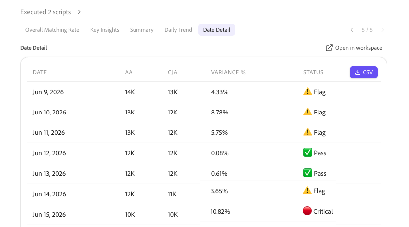
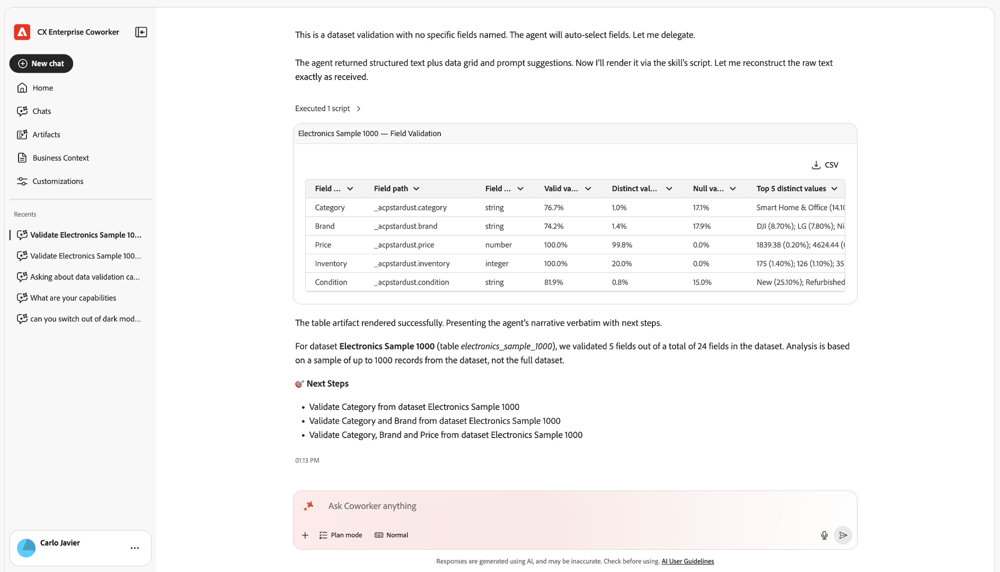

O Adobe CX Enterprise Coworker Chat permite que as equipes automatizem tarefas de produtos Adobe usando linguagem natural, transformando rapidamente ideias em ações com planejamento flexível, habilidades personalizáveis e execução inteligente. Para obter informações mais gerais sobre o Colaborador, consulte [visão geral do CX Enterprise Coworker](/help/coworker/overview.md).

## Análise de dados com o Chat do colaborador

O Bate-papo com colegas de trabalho pode executar uma análise de dados avançada que antes só era possível no Analysis Workspace. O Bate-papo com colegas de trabalho acessa os dados das visualizações de dados do Customer Journey Analytics ou dos conjuntos de relatórios do Adobe Analytics, permitindo que você explore esses dados e obtenha respostas para prompts em linguagem natural.

Ao criar uma visualização no bate-papo do Colaborador, você pode abri-la no Analysis Workspace a qualquer momento para obter mais controle manual.

As informações a seguir fornecem uma visão geral de como você pode analisar dados no Chat de colaborador.

## Iniciar análise no Chat do Colaborador

Comece descrevendo o que você deseja saber em linguagem simples. O Chat do colaborador planeja a análise, consulta suas visualizações de dados ou conjuntos de relatórios e cria visualizações e resumos.

Os casos de uso abaixo são exemplos. Você pode perguntar sobre qualquer dado que tenha permissão para acessar

### Principais casos de uso

<!-- The following cards link to each of the stand-alone articles in this folder -->

<!--
CARDS

* https://experienceleague.adobe.com/en/docs/cx-enterprise-ai/experience-cloud-ai/coworker/chat/use-cases/data-insights/analytics-chat
  {title = Analyze Customer Journey Analytics and Adobe Analytics data}
  {description = Answers natural-language questions about your data views or report suites, builds funnels and other visualizations, and finds where customers drop off. You can open any visualization in Analysis Workspace for further analysis.}
  {cta = Read}
  {image = ../../assets/coworker-funnel-response-card.png}

* https://experienceleague.adobe.com/en/docs/cx-enterprise-ai/experience-cloud-ai/coworker/chat/use-cases/data-insights/root-cause-analysis
  {title = Explore trends and root causes}
  {description = Identifies trends in your Customer Journey Analytics and Adobe Analytics data and the factors that drive changes in performance, without manual queries.}
  {cta = Read}
  {image = ../../assets/data-validation-aa-cja/trend-line-card.png}
-->
<!-- START CARDS HTML - DO NOT MODIFY BY HAND -->

    

        

            

                <figure class="image x-is-16by9">
                    
                </figure>
            

            

                

                    

                        <a href="https://experienceleague.adobe.com/en/docs/cx-enterprise-ai/experience-cloud-ai/coworker/chat/use-cases/data-insights/analytics-chat" title="Analisar dados do Customer Journey Analytics e do Adobe Analytics">Analisar dados do Customer Journey Analytics e do Adobe Analytics</a>
                    

                    
Responde perguntas em linguagem natural sobre suas visualizações de dados ou conjuntos de relatórios, cria funis e outras visualizações e descobre onde os clientes chegam. É possível abrir qualquer visualização no Analysis Workspace para análise adicional.

                

                <a href="https://experienceleague.adobe.com/en/docs/cx-enterprise-ai/experience-cloud-ai/coworker/chat/use-cases/data-insights/analytics-chat" class="spectrum-Button spectrum-Button--outline spectrum-Button--primary spectrum-Button--sizeM" style="align-self: flex-start; margin-top: 1rem;">
                    Leitura
                </a>
            

        

    

    

        

            

                <figure class="image x-is-16by9">
                    
                </figure>
            

            

                

                    

                        <a href="https://experienceleague.adobe.com/en/docs/cx-enterprise-ai/experience-cloud-ai/coworker/chat/use-cases/data-insights/root-cause-analysis" title="Explorar tendências e causas básicas">Explorar tendências e causas básicas</a>
                    

                    
Identifica tendências em seus dados do Customer Journey Analytics e do Adobe Analytics e os fatores que impulsionam alterações no desempenho, sem consultas manuais.

                

                <a href="https://experienceleague.adobe.com/en/docs/cx-enterprise-ai/experience-cloud-ai/coworker/chat/use-cases/data-insights/root-cause-analysis" class="spectrum-Button spectrum-Button--outline spectrum-Button--primary spectrum-Button--sizeM" style="align-self: flex-start; margin-top: 1rem;">
                    Leitura
                </a>
            

        

    

<!-- END CARDS HTML - DO NOT MODIFY BY HAND -->

<!--
CARDS

* https://experienceleague.adobe.com/en/docs/cx-enterprise-ai/experience-cloud-ai/coworker/chat/use-cases/data-insights/implementation-guide
  {title = Plan your implementation}
  {description = Creates a personalized, step-by-step plan for implementing Customer Journey Analytics, upgrading from Adobe Analytics, or setting up Content Analytics, Marketing Campaign Analytics, or Streaming Media collection on the Edge. Plans include details such as owners, effort estimates, dependencies, and validation steps.}
  {cta = Read}
  {image = ../../assets/ui-guide-6.png}

* https://experienceleague.adobe.com/en/docs/cx-enterprise-ai/experience-cloud-ai/coworker/chat/use-cases/data-insights/intelligent-checklist
  {title = Generate an implementation checklist}
  {description = Turns your Customer Journey Analytics implementation plan into a checklist in Coworker Projects, where your team can assign steps, track status, and add approval gates.}
  {cta = Read}
  {image = ../../assets/data-validation-aa-cja/date-detail.png}
-->
<!-- START CARDS HTML - DO NOT MODIFY BY HAND -->

    

        

            

                <figure class="image x-is-16by9">
                    
                </figure>
            

            

                

                    

                        <a href="https://experienceleague.adobe.com/en/docs/cx-enterprise-ai/experience-cloud-ai/coworker/chat/use-cases/data-insights/implementation-guide" title="Planejar a implementação">Planeje sua implementação</a>
                    

                    
Cria um plano personalizado e passo a passo para implementar o Customer Journey Analytics, atualizar da Adobe Analytics ou configurar a coleção Content Analytics, Marketing Campaign Analytics ou Streaming de Mídia na Edge. Os planos incluem detalhes como proprietários, estimativas de esforço, dependências e etapas de validação.

                

                <a href="https://experienceleague.adobe.com/en/docs/cx-enterprise-ai/experience-cloud-ai/coworker/chat/use-cases/data-insights/implementation-guide" class="spectrum-Button spectrum-Button--outline spectrum-Button--primary spectrum-Button--sizeM" style="align-self: flex-start; margin-top: 1rem;">
                    Leitura
                </a>
            

        

    

    

        

            

                <figure class="image x-is-16by9">
                    
                </figure>
            

            

                

                    

                        <a href="https://experienceleague.adobe.com/en/docs/cx-enterprise-ai/experience-cloud-ai/coworker/chat/use-cases/data-insights/intelligent-checklist" title="Gerar uma lista de verificação de implementação">Gerar uma lista de verificação de implementação</a>
                    

                    
Transforma seu plano de implementação do Customer Journey Analytics em uma lista de verificação em Projetos de colaboração, onde sua equipe pode atribuir etapas, rastrear status e adicionar portas de aprovação.

                

                <a href="https://experienceleague.adobe.com/en/docs/cx-enterprise-ai/experience-cloud-ai/coworker/chat/use-cases/data-insights/intelligent-checklist" class="spectrum-Button spectrum-Button--outline spectrum-Button--primary spectrum-Button--sizeM" style="align-self: flex-start; margin-top: 1rem;">
                    Leitura
                </a>
            

        

    

<!-- END CARDS HTML - DO NOT MODIFY BY HAND -->

<!--
CARDS

* https://experienceleague.adobe.com/en/docs/cx-enterprise-ai/experience-cloud-ai/coworker/chat/use-cases/data-insights/data-validation-aa-cja
  {title = Validate data when upgrading from Adobe Analytics to Customer Journey Analytics}
  {description = Compares dimensions, metrics, and trends between your Adobe Analytics report suites and Customer Journey Analytics data views, then recommends fixes to support your upgrade.}
  {cta = Read}
  {image = ../../assets/data-validation-aa-cja/trend-bar-card.png}

* https://experienceleague.adobe.com/en/docs/cx-enterprise-ai/experience-cloud-ai/coworker/chat/use-cases/data-insights/streaming-media-validation
  {title = Validate your Streaming Media implementation}
  {description = Checks your datastream, schema, dataset, data view, and session data to confirm that streaming media tracking is configured and collecting data correctly.}
  {cta = Read}
  {image = ../../assets/ui-guide-8.png}
-->
<!-- START CARDS HTML - DO NOT MODIFY BY HAND -->

    

        

            

                <figure class="image x-is-16by9">
                    
                </figure>
            

            

                

                    

                        <a href="https://experienceleague.adobe.com/en/docs/cx-enterprise-ai/experience-cloud-ai/coworker/chat/use-cases/data-insights/data-validation-aa-cja" title="Validar dados ao atualizar do Adobe Analytics para o Customer Journey Analytics">Validar dados ao atualizar do Adobe Analytics para o Customer Journey Analytics</a>
                    

                    
Compara dimensões, métricas e tendências entre seus conjuntos de relatórios do Adobe Analytics e visualizações de dados do Customer Journey Analytics e, em seguida, recomenda correções para dar suporte à atualização.

                

                <a href="https://experienceleague.adobe.com/en/docs/cx-enterprise-ai/experience-cloud-ai/coworker/chat/use-cases/data-insights/data-validation-aa-cja" class="spectrum-Button spectrum-Button--outline spectrum-Button--primary spectrum-Button--sizeM" style="align-self: flex-start; margin-top: 1rem;">
                    Leitura
                </a>
            

        

    

    

        

            

                <figure class="image x-is-16by9">
                    
                </figure>
            

            

                

                    

                        <a href="https://experienceleague.adobe.com/en/docs/cx-enterprise-ai/experience-cloud-ai/coworker/chat/use-cases/data-insights/streaming-media-validation" title="Validar a implementação da mídia de transmissão">Validar a implementação de mídia de streaming</a>
                    

                    
Verifica o fluxo de dados, o esquema, o conjunto de dados, a visualização de dados e os dados da sessão para confirmar se o rastreamento de mídia de transmissão está configurado e coletando os dados corretamente.

                

                <a href="https://experienceleague.adobe.com/en/docs/cx-enterprise-ai/experience-cloud-ai/coworker/chat/use-cases/data-insights/streaming-media-validation" class="spectrum-Button spectrum-Button--outline spectrum-Button--primary spectrum-Button--sizeM" style="align-self: flex-start; margin-top: 1rem;">
                    Leitura
                </a>
            

        

    

<!-- END CARDS HTML - DO NOT MODIFY BY HAND -->

<!--
CARDS

* https://experienceleague.adobe.com/en/docs/cx-enterprise-ai/experience-cloud-ai/coworker/chat/use-cases/data-insights/validate-dataset-quality-for-cja
  {title = Validate dataset quality for Customer Journey Analytics}
  {description = Identifies the datasets that feed your Customer Journey Analytics reporting, then checks schemas, identity quality, and field quality so you can resolve issues before you build dashboards.}
  {cta = Read}
  {image = ../../assets/data-validation-aep/dataset-validation.png}

* https://experienceleague.adobe.com/en/docs/cx-enterprise-ai/experience-cloud-ai/coworker/chat/use-cases/data-insights/data-validation-aep
  {title = Validate data after ingestion into Experience Platform}
  {description = Runs statistical and semantic checks on Experience Platform datasets and fields to find data quality issues, such as invalid values or mapping problems.}
  {cta = Read}
  {image = ../../assets/data-validation-aep/null-values.png}
-->
<!-- START CARDS HTML - DO NOT MODIFY BY HAND -->

    

        

            

                <figure class="image x-is-16by9">
                    
                </figure>
            

            

                

                    

                        <a href="https://experienceleague.adobe.com/en/docs/cx-enterprise-ai/experience-cloud-ai/coworker/chat/use-cases/data-insights/validate-dataset-quality-for-cja" title="Validar a qualidade do conjunto de dados para o Customer Journey Analytics">Validar a qualidade do conjunto de dados para o Customer Journey Analytics</a>
                    

                    
Identifica os conjuntos de dados que alimentam seus relatórios do Customer Journey Analytics e, em seguida, verifica os esquemas, a qualidade da identidade e a qualidade do campo para que você possa resolver problemas antes de criar painéis.

                

                <a href="https://experienceleague.adobe.com/en/docs/cx-enterprise-ai/experience-cloud-ai/coworker/chat/use-cases/data-insights/validate-dataset-quality-for-cja" class="spectrum-Button spectrum-Button--outline spectrum-Button--primary spectrum-Button--sizeM" style="align-self: flex-start; margin-top: 1rem;">
                    Leitura
                </a>
            

        

    

    

        

            

                <figure class="image x-is-16by9">
                    
                </figure>
            

            

                

                    

                        <a href="https://experienceleague.adobe.com/en/docs/cx-enterprise-ai/experience-cloud-ai/coworker/chat/use-cases/data-insights/data-validation-aep" title="Validar dados após assimilação no Experience Platform">Validar dados após assimilação no Experience Platform</a>
                    

                    
Executa verificações estatísticas e semânticas em conjuntos de dados e campos do Experience Platform para encontrar problemas de qualidade de dados, como valores inválidos ou problemas de mapeamento.

                

                <a href="https://experienceleague.adobe.com/en/docs/cx-enterprise-ai/experience-cloud-ai/coworker/chat/use-cases/data-insights/data-validation-aep" class="spectrum-Button spectrum-Button--outline spectrum-Button--primary spectrum-Button--sizeM" style="align-self: flex-start; margin-top: 1rem;">
                    Leitura
                </a>
            

        

    

<!-- END CARDS HTML - DO NOT MODIFY BY HAND -->

Para obter mais informações sobre esses casos de uso, incluindo as habilidades que eles usam e prompts de amostra, consulte [Casos de uso de insights de dados](/help/coworker/chat/use-cases/overview.md#data-insights).

### Introdução

O Bate-papo com colegas de trabalho também pode ajudá-lo a:

* **Comparar desempenho**: comparar métricas entre canais, períodos de tempo ou segmentos lado a lado.
* **Meça o desempenho da campanha**: veja como as campanhas, os canais e as propriedades da Web foram executados em um determinado período.
* **Analisar funis**: passe pelos funis de conversão de várias etapas e veja a entrega em cada estágio.
* **Métricas de previsão**: projete valores de métricas futuras a partir de dados históricos do Customer Journey Analytics ou do Adobe Analytics, por exemplo, se você está no caminho para atingir uma meta de receita.
* **Crie resumos executivos e resumos de KPI**: produza resumos de desempenho, recomendações e descrições de slides prontos para as partes interessadas.
* **Analise tendências e causas operacionais**: consulte dados de séries temporais históricas de públicos, conjuntos de dados e jornadas e identifique o que causou uma alteração.
* **Criar habilidades personalizadas do Customer Journey Analytics**: transforme uma análise que você repete em uma habilidade reutilizável que persiste entre as sessões.

<!--
CARDS

* https://experienceleague.adobe.com/en/docs/cx-enterprise-ai/experience-cloud-ai/coworker/chat/use-cases/data-insights/analytics-chat
  {title = Analyze data with Coworker Chat}
  {description = Ask questions in natural language to build funnels, create visualizations, and find where customers drop off in the journey.}
  {cta = Read}
  {image = ../../assets/coworker-funnel-response-card.png}

* https://experienceleague.adobe.com/en/docs/cx-enterprise-ai/experience-cloud-ai/coworker/chat/use-cases/data-insights/root-cause-analysis
  {title = Explore trends and root causes}
  {description = Investigate changes in your Customer Journey Analytics data and uncover what drives them, without writing manual queries.}
  {cta = Read}
  {image = ../../assets/data-validation-aa-cja/trend-line-card.png}
-->
<!-- START CARDS HTML - DO NOT MODIFY BY HAND -->

    

        

            

                <figure class="image x-is-16by9">
                    
                </figure>
            

            

                

                    

                        
                    

                    
Faça perguntas em linguagem natural para criar funis, criar visualizações e descobrir onde os clientes chegam na jornada.

                

                <a href="https://experienceleague.adobe.com/en/docs/cx-enterprise-ai/experience-cloud-ai/coworker/chat/use-cases/data-insights/analytics-chat" class="spectrum-Button spectrum-Button--outline spectrum-Button--primary spectrum-Button--sizeM" style="align-self: flex-start; margin-top: 1rem;">
                    Leitura
                </a>
            

        

    

    

        

            

                <figure class="image x-is-16by9">
                    
                </figure>
            

            

                

                    

                        <a href="https://experienceleague.adobe.com/en/docs/cx-enterprise-ai/experience-cloud-ai/coworker/chat/use-cases/data-insights/root-cause-analysis" title="Explorar tendências e causas básicas">Explorar tendências e causas básicas</a>
                    

                    
Investigue alterações nos dados do Customer Journey Analytics e descubra o que as impulsiona, sem gravar consultas manuais.

                

                <a href="https://experienceleague.adobe.com/en/docs/cx-enterprise-ai/experience-cloud-ai/coworker/chat/use-cases/data-insights/root-cause-analysis" class="spectrum-Button spectrum-Button--outline spectrum-Button--primary spectrum-Button--sizeM" style="align-self: flex-start; margin-top: 1rem;">
                    Leitura
                </a>
            

        

    

<!-- END CARDS HTML - DO NOT MODIFY BY HAND -->

<!--
CARDS

* https://experienceleague.adobe.com/en/docs/cx-enterprise-ai/experience-cloud-ai/coworker/chat/use-cases/data-insights/validate-dataset-quality-for-cja
  {title = Validate Customer Journey Analytics data}
  {description = Check dataset quality with the data validation skill and resolve issues before you build dashboards.}
  {cta = Read}
  {image = ../../assets/data-validation-aep/dataset-validation.png}

* https://experienceleague.adobe.com/en/docs/cx-enterprise-ai/experience-cloud-ai/coworker/chat/use-cases/data-insights/data-validation-aa-cja
  {title = Validate data during your upgrade}
  {description = Compare Adobe Analytics and Customer Journey Analytics data to confirm that your upgrade is on track.}
  {cta = Read}
  {image = ../../assets/data-validation-aa-cja/trend-bar-card.png}
-->
<!-- START CARDS HTML - DO NOT MODIFY BY HAND -->

    

        

            

                <figure class="image x-is-16by9">
                    
                </figure>
            

            

                

                    

                        <a href="https://experienceleague.adobe.com/en/docs/cx-enterprise-ai/experience-cloud-ai/coworker/chat/use-cases/data-insights/validate-dataset-quality-for-cja" title="Validar dados do Customer Journey Analytics">Validar dados do Customer Journey Analytics</a>
                    

                    
Verifique a qualidade do conjunto de dados com a habilidade de validação de dados e resolva os problemas antes de criar painéis.

                

                <a href="https://experienceleague.adobe.com/en/docs/cx-enterprise-ai/experience-cloud-ai/coworker/chat/use-cases/data-insights/validate-dataset-quality-for-cja" class="spectrum-Button spectrum-Button--outline spectrum-Button--primary spectrum-Button--sizeM" style="align-self: flex-start; margin-top: 1rem;">
                    Leitura
                </a>
            

        

    

    

        

            

                <figure class="image x-is-16by9">
                    
                </figure>
            

            

                

                    

                        <a href="https://experienceleague.adobe.com/en/docs/cx-enterprise-ai/experience-cloud-ai/coworker/chat/use-cases/data-insights/data-validation-aa-cja" title="Validar dados durante a atualização">Validar dados durante a atualização</a>
                    

                    
Compare os dados do Adobe Analytics e do Customer Journey Analytics para confirmar se a atualização está no caminho certo.

                

                <a href="https://experienceleague.adobe.com/en/docs/cx-enterprise-ai/experience-cloud-ai/coworker/chat/use-cases/data-insights/data-validation-aa-cja" class="spectrum-Button spectrum-Button--outline spectrum-Button--primary spectrum-Button--sizeM" style="align-self: flex-start; margin-top: 1rem;">
                    Leitura
                </a>
            

        

    

<!-- END CARDS HTML - DO NOT MODIFY BY HAND -->

## Layout da tabela dos principais casos de uso

<!-- The following table are links to each of the stand-alone articles in this folder -->

| Caso de uso | Descrição |
| --- | --- |
| [Analisar dados do Customer Journey Analytics e do Adobe Analytics](/help/coworker/chat/use-cases/data-insights/analytics-chat.md) | Responde perguntas em linguagem natural sobre suas visualizações de dados ou conjuntos de relatórios, cria funis e outras visualizações e descobre onde os clientes chegam. É possível abrir qualquer visualização no Analysis Workspace para análise adicional. |
| [Explorar tendências e causas básicas](/help/coworker/chat/use-cases/data-insights/root-cause-analysis.md) | Identifica tendências em seus dados do Customer Journey Analytics e do Adobe Analytics e os fatores que impulsionam alterações no desempenho, sem consultas manuais. |
| [Planeje sua implementação](/help/coworker/chat/use-cases/data-insights/implementation-guide.md) | Cria um plano personalizado e passo a passo para implementar o Customer Journey Analytics, atualizar da Adobe Analytics ou configurar a coleção Content Analytics, Marketing Campaign Analytics ou Streaming de Mídia na Edge. Os planos incluem detalhes como proprietários, estimativas de esforço, dependências e etapas de validação. |
| [Gerar uma lista de verificação de implementação](/help/coworker/chat/use-cases/data-insights/intelligent-checklist.md) | Transforma seu plano de implementação do Customer Journey Analytics em uma lista de verificação em Projetos de colaboração, onde sua equipe pode atribuir etapas, rastrear status e adicionar portas de aprovação. |
| [Validar dados ao atualizar do Adobe Analytics para o Customer Journey Analytics](/help/coworker/chat/use-cases/data-insights/data-validation-aa-cja.md) | Compara dimensões, métricas e tendências entre seus conjuntos de relatórios do Adobe Analytics e visualizações de dados do Customer Journey Analytics e, em seguida, recomenda correções para dar suporte à atualização. |
| [Validar a implementação de mídia de streaming](/help/coworker/chat/use-cases/data-insights/streaming-media-validation.md) | Verifica o fluxo de dados, o esquema, o conjunto de dados, a visualização de dados e os dados da sessão para confirmar se o rastreamento de mídia de transmissão está configurado e coletando os dados corretamente. |
| [Validar a qualidade do conjunto de dados para o Customer Journey Analytics](/help/coworker/chat/use-cases/data-insights/validate-dataset-quality-for-cja.md) | Identifica os conjuntos de dados que alimentam seus relatórios do Customer Journey Analytics e, em seguida, verifica os esquemas, a qualidade da identidade e a qualidade do campo para que você possa resolver problemas antes de criar painéis. |
| [Validar dados após assimilação no Experience Platform](/help/coworker/chat/use-cases/data-insights/data-validation-aep.md) | Executa verificações estatísticas e semânticas em conjuntos de dados e campos do Experience Platform para encontrar problemas de qualidade de dados, como valores inválidos ou problemas de mapeamento. |

Para obter mais informações sobre esses casos de uso, incluindo as habilidades que eles usam e prompts de amostra, consulte [Casos de uso de insights de dados](/help/coworker/chat/use-cases/overview.md#data-insights).

