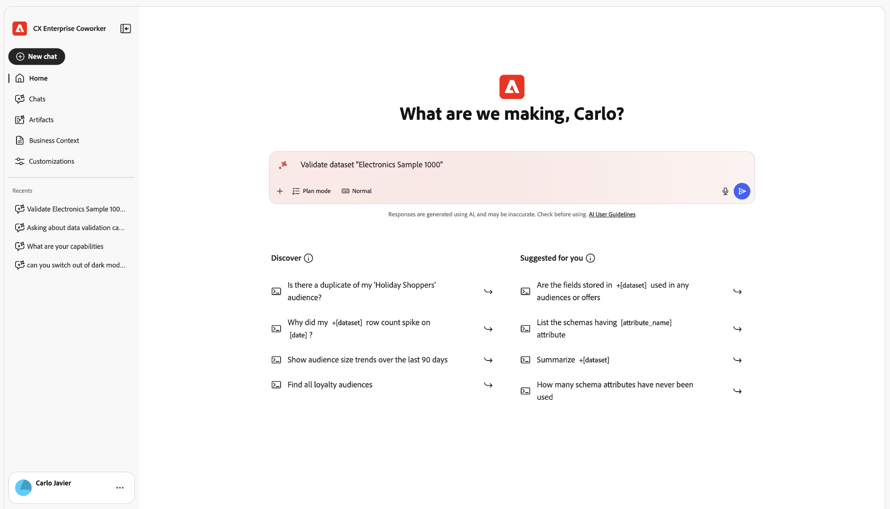

# Valide os dados do Experience Platform com o Co-worker

O colaborador inclui a habilidade Validação de dados, que verifica a qualidade dos dados dos conjuntos de dados do Experience Platform. Use-a para executar validações estatísticas e semânticas em conjuntos de dados, analisar campos de conjuntos de dados e identificar problemas de qualidade de dados, tudo por meio de uma única conversa no Chat de colegas de trabalho.

Engenheiros de dados, administradores de dados e engenheiros de implementação o usam para verificações rápidas de qualidade, sem consultas SQL ou hierarquias de esquema complexas.

Use esta habilidade para:

* Valide os campos de identidade e evento principais após uma nova implementação ou atualização de implementação.
* Investigue um problema de mapeamento suspeito inspecionando os valores principais e os valores inválidos de um campo.
* Execute verificações contínuas de gerenciamento de dados em conjuntos de dados críticos para capturar regressões antecipadamente.

<!--TODO: skill display name "Data Validation skill" confirmed via the published KT-22622 video page (validate-dataset-quality-for-cja.md, merged 2026-09-16). Still need the technical skill ID from engineering (Petru Adrian Snep) for the use-cases overview table row. That page didn't add one either.-->

>[!NOTE]
>
>Esta habilidade é somente leitura. Isso não altera seus dados, esquemas ou mapeamentos.

## Antes de começar

Para validar seus dados com o Colaborador, é necessário:

* O nome ou a ID do conjunto de dados que você deseja validar.
* (Opcional) O nome de um campo específico a ser validado, se você não quiser que a habilidade selecione campos automaticamente.

## Iniciar uma sessão de validação

1. Faça logon no Colaborador.

1. Selecione [!UICONTROL **Novo Chat**].

1. No campo de texto, solicite que o agente valide um campo ou conjunto de dados. Por exemplo:

   **Aviso**

   > Validar conjunto de dados &quot;Amostra de eletrônicos 1000&quot;

   

   >[!TIP]
   >
   >Coloque a palavra &quot;conjunto de dados&quot; como prefixo no nome do conjunto de dados para que a habilidade possa identificá-lo corretamente. Por exemplo, use &quot;Validar a amostra de 1000 do conjunto de dados Eletrônicos&quot; em vez de &quot;Validar amostra de 1000 de eletrônicos&quot;.

   Sua solicitação é roteada para a habilidade Validação de dados, que analisa uma amostra do seu conjunto de dados e retorna resultados na mesma conversa.

## Escolher o que validar

É possível validar um único campo ou um conjunto de dados inteiro.

>[!BEGINTABS]

>[!TAB Validação de campo]

Validar um campo específico em um conjunto de dados. Essa opção fornece:

* Contagem nula e contagem de valor distinto.
* Principais valores distintos e suas frequências.
* Validação semântica assistida por IA que sinaliza valores que não correspondem ao formato esperado do campo, com base nos metadados do campo e em seus valores reais.

Exemplo de prompts:

* Valide o campo de email no conjunto de dados Customers_2024.
* Validar o status do campo para o conjunto de dados customer_events_2024.
* Validar o campo person.address.city para o conjunto de dados Dados do cliente.

>[!TAB Validação do conjunto de dados]

Validar até cinco campos em um conjunto de dados de uma só vez. Você mesmo pode especificar os campos ou permitir que a habilidade analise o conjunto de dados e selecione automaticamente os campos mais relevantes. Essa opção retorna as mesmas informações que a validação de campo, em todos os campos validados.

Exemplo de prompts:

* Validar o conjunto de dados Dados do cliente de 2024.
* Valide os campos email, telefone para Customers_2024.
* Resumir firstName, lastName, birthDate para Dados do cliente.

>[!ENDTABS]

## Revise os resultados

Para cada campo validado, os resultados são exibidos como uma linha em uma tabela com as seguintes colunas:

| Coluna | Descrição |
| --- | --- |
| [!UICONTROL Nome do campo] | O nome do campo. |
| [!UICONTROL Caminho do campo] | O caminho completo do campo no esquema. |
| [!UICONTROL Tipo de campo] | O tipo de dados do campo. |
| [!UICONTROL Valores válidos] | A porcentagem de valores de amostra que passaram na validação. |
| [!UICONTROL Valores distintos] | A porcentagem de valores de amostra que são distintos. |
| [!UICONTROL Valores nulos] | A porcentagem de valores de amostra que são nulos. |
| [!UICONTROL Cinco valores distintos principais] | Os cinco valores mais comuns e suas frequências. |
| [!UICONTROL Os 5 primeiros valores inválidos] | Os cinco valores inválidos mais comuns, com uma explicação para cada, por exemplo &quot;não é um formato de email válido&quot;. |
| [!UICONTROL insight Adicional] | Uma breve nota em linguagem natural sobre a qualidade do campo. |

Abaixo dos resultados, o Colaborador adiciona uma lista de **Próximas etapas** sugerindo prompts de acompanhamento, como validar outro campo ou executar novamente o conjunto de dados.

Quando você valida um único campo, o Colaborador também retorna um gráfico:

Selecione [!UICONTROL **Gráfico**] ou [!UICONTROL **Tabela**] para alternar entre exibições dos mesmos resultados.

Ao validar um conjunto de dados, os resultados são exibidos em uma tabela com uma linha por campo. Os campos que você mesmo nomeia aparecem conforme os especificou:

Os campos selecionados pela habilidade aparecem automaticamente da mesma maneira:

Selecione [!UICONTROL **CSV**] para baixar a tabela de resultados completa.

## Verificações executadas pela validação de dados

A habilidade realiza os seguintes tipos de verificações em cada campo e conjunto de dados:

* **Verificações de integridade**: contagens e porcentagens nulas e ausentes.
* **Verificações de distribuição**: os principais valores distintos e suas distribuições e a detecção de alta cardinalidade.
* **Verificações semânticas em relação ao esquema**: usa o nome, o tipo e a descrição do campo XDM para inferir a aparência de um valor válido e sinaliza anomalias.
* **Verificações com reconhecimento de tipo de dados**, quando aplicável:
  * Email: formato e plausibilidade do domínio.
  * Phone: preparação do formato, por exemplo, E.164.
  * Datas e carimbos de data e hora: verificações básicas de formato, por exemplo, ISO-8601.

Essas verificações combinam estatísticas determinísticas com validação semântica assistida por LLM para detectar valores que parecem errados mesmo quando tecnicamente correspondem ao esquema.

## Limitações

Antes de validar seus dados, lembre-se das limitações a seguir. Essas restrições equilibram o desempenho com a funcionalidade e definem expectativas para a análise e os insights que você pode esperar.

* **Somente amostragem**: a habilidade valida uma amostra do conjunto de dados (normalmente as 1.000 linhas mais recentes), não todo o conjunto de dados. As verificações completas do conjunto de dados não estão disponíveis.
* **Limite de contagem de campos**: quando você valida um conjunto de dados, a habilidade analisa até cinco campos por solicitação. Você pode especificar esses campos ou permitir que a habilidade os selecione automaticamente.
* **Semântica probabilística**: a detecção de valores inválidos depende em parte de inferência baseada em LLM, que pode ocasionalmente perder erros sutis ou sinalizar valores de linha de borda.
* **Somente leitura**: a habilidade não altera seus dados ou seu esquema. Ela destaca os problemas em potencial, mas não executa correções automáticas.

Se suas necessidades de validação forem mais exaustivas ou exigirem uma lógica de negócios complexa, complemente esses resultados com ferramentas adicionais, como o Serviço de consulta ou as validações de Preparo de dados.

**Informações relacionadas**

* [Validar dados do Adobe Analytics para o Customer Journey Analytics ao atualizar](./data-validation-aa-cja.md)
* [Validar dados do Customer Journey Analytics com a habilidade Validação de dados no Co-worker](./validate-dataset-quality-for-cja.md)
* [Validar seus dados (Assistente de IA)](/help/agents/data-validation.md)
* [Confie nos seus relatórios do Customer Journey Analytics: habilidade de validação de dados no Adobe CX Coworker](https://www.youtube.com/watch?v=gCSm_QYSYhk) (vídeo)
