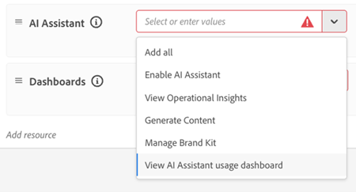

# Painéis de monitoramento de IA corporativa

O painel de [!UICONTROL Monitoramento] da IA de agência oferece aos membros do Centro de Excelência (COE) e a outras partes interessadas da governança visibilidade sobre o uso e a adoção da IA de agência. Visualize tendências de 7 ou 30 dias para ver quem usa [!DNL AI Assistant] ou outras superfícies (como [Adobe Marketing Agent for Microsoft 365 Copilot](https://experienceleague.adobe.com/pt-br/docs/cx-enterprise-ai/experience-cloud-ai/agents/ama-ms)) para interagir com [!DNL Experience Platform Agents] e o valor que elas recebem. Juntas, essas visualizações ajudam a orientar a adoção de agentes com dados em vez de suposições.

**Disponibilidade**

* Atualmente, qualquer conta com uma licença para pelo menos um aplicativo nativo do Experience Platform (Customer Journey Analytics, Journey Optimizer ou Real-Time CDP) pode acessar esse painel
* As métricas de uso e adoção para [aplicativos AI-first](agentic-ai.md#ai-first-cx-enterprise-applications) como Experimentation Accelerator, LLM Optimizer e Sites Optimizer não estão no escopo deste painel.

O painel de [!UICONTROL Monitoramento] inclui as seguintes exibições:

| Painel | Finalidade |
| --- | --- |
| **Visão geral** | Métricas agregadas entre usuários, conversas, feedback e consumo de crédito |
| **Usuários** | Frequência de uso, distribuição e envolvimento por usuário |
| **Feedback** | Sinais sobre a qualidade da resposta e a satisfação do usuário |
| **Créditos de IA** | Tendências de consumo de crédito e saldo restante |

A documentação da [IA de agente na Adobe CX Enterprise](agentic-ai.md) lista os agentes no escopo para monitoramento de uso na tabela [agentes de IA em aplicativos CX Enterprise existentes](agentic-ai.md#existing-apps-table).

>[!VIDEO](https://video.tv.adobe.com/v/3491864?learn=on)

## Habilitar permissões de painel {#permissions}

Conceda acesso ao painel em [!DNL Adobe Experience Platform] atualizando o perfil do produto ou a função para cada usuário autorizado. O recurso [!UICONTROL Monitoramento] é exibido para os usuários na home page do CX Enterprise após a habilitação das permissões.

>[!IMPORTANT]
>
>O monitoramento de dados está disponível somente na sandbox de produção padrão. Sandboxes de desenvolvimento não são compatíveis com a exibição de dados de monitoramento. Os usuários devem ter as permissões de Monitoramento necessárias para a sandbox de produção padrão e alternar para essa sandbox para exibir dados de monitoramento.
>
>Para ajudar a evitar confusão, a Adobe recomenda conceder permissões de Monitoramento em todas as sandboxes, incluindo a sandbox de produção padrão. Isso ajuda a garantir que os usuários possam acessar o painel de monitoramento, independentemente da sandbox selecionada no momento, e reduz a probabilidade de confundir uma sandbox não compatível com um painel vazio ou não funcional.

**Para habilitar permissões de painel**

1. Vá para [!DNL Experience Platform] **Administração** > **Permissões**.

1. Abra o perfil de produto ou a função que deseja atualizar.

   

1. Em **[!UICONTROL Permissões do Assistente de IA]**, clique em **[!UICONTROL Adicionar recurso]** e habilite o **[!UICONTROL Exibir painel de uso do Assistente de IA]**.

   Essa permissão concede acesso aos painéis de monitoramento de uso da IA de agente.

1. Em **[!UICONTROL Painéis]** permissões, configure o acesso ao painel com base nas responsabilidades de cada usuário.

   

   Permissões recomendadas para usuários autorizados do controle:

   * **[!UICONTROL Exibir Painel de Uso de Licenças]**
   * **[!UICONTROL Exibir Painéis Padrão]**
   * **[!UICONTROL Exportar Dados do Painel]** (opcional, somente para usuários de governança aprovados)

   Permissões adicionais que você pode conceder quando necessário:

   * **[!UICONTROL Gerenciar Painéis Personalizados]**
   * **[!UICONTROL Exibir Painéis Personalizados]**
   * **[!UICONTROL Gerenciar Painéis Padrão]**

1. Para exibir painéis, retorne à página inicial do CX Enterprise e clique em **[!UICONTROL Monitoramento]**.

   

## Painel de visão geral

O painel Visão geral é o local central para métricas de adoção e envolvimento em toda a organização. Ele conecta tendências de alto nível a análises mais profundas. Para ver os fatores que influenciam as métricas, analise as conversas individuais a partir de qualquer métrica.

### Métricas no painel Visão geral

* **Avisos ao longo do tempo:** Crescimento do uso geral e tendências de adoção.
* **Usuários e conversas ativos:** Contagem de usuários interagindo com [!DNL Experience Platform Agents].
* **Média de prompts por conversa:** Profundidade da participação por conversa.
* **Feedback:** Distribuição de miniaturas para cima e miniaturas para baixo do feedback dos usuários (somente para [!DNL AI Assistant] interações).

>[!VIDEO](https://video.tv.adobe.com/v/3491865?learn=on)

### Repetição da conversa

A repetição da conversa mostra interações individuais, não apenas agregações. Você pode analisar padrões em várias conversas e mudar de tendências de alto nível para uma conversa específica.

* **Histórico de prompts e respostas:** o prompt do usuário e as respostas entregues.
* **Sinais de feedback:** Interações de usuários marcadas com polegares para cima ou para baixo, para identificar necessidades de atrito, bloqueadores ou de habilitação. Essas informações ajudam a sua organização a melhorar a relevância imediata e ajudam a Adobe a melhorar a qualidade da resposta ao longo do tempo.

>[!VIDEO](https://video.tv.adobe.com/v/3491866?learn=on)

## Painel de usuários

O painel Usuários mostra como a adoção e o engajamento do agente variam entre os usuários ao longo do tempo. Você pode ver quem usa ativamente o [!DNL Experience Platform Agents], qual superfície ele usa e com que frequência ele interage. Os administradores e membros do COE podem detalhar atividades e conversas de usuários individuais para entender os padrões de engajamento e o comportamento de uso.

### Métricas no painel Usuários

* **Tendências de adoção e envolvimento ao longo do tempo:** Rastreie como os segmentos de usuários mudam durante o período selecionado. Os usuários são classificados como:
  * **Novo:** primeira atividade no período selecionado, sem atividade durante os 12 meses anteriores.
  * **Repetir:** atividade tanto no período selecionado quanto no período anterior.
  * **Retorno:** Atividade no período selecionado, mas não no período anterior.
  * **Inativo:** nenhuma atividade no período selecionado, mas a atividade no período anterior.
* **Padrões de engajamento do usuário:** a frequência com que os usuários interagem com agentes e como o engajamento muda ao longo do tempo.
* **Atividade de conversa:** Número de conversas e prompts por usuário.
* **Principais usuários ativos:** usuários e equipes altamente engajados que impulsionam a adoção de agentes.

>[!VIDEO](https://video.tv.adobe.com/v/3491868?learn=on)

## Painel de comentários

O painel Feedback mostra o feedback do usuário enviado para interações do agente. Você pode ver quais conversas os usuários marcaram de forma positiva ou negativa e investigar as interações por trás do feedback. Para revisar prompts, respostas, detalhes de raciocínio e notas de feedback, aprofunde-se em conversas individuais a partir de resumos de feedback.

### Métricas no painel de Feedback

* **Tendências dos comentários ao longo do tempo:** como os comentários dos usuários mudam ao longo do tempo.
* **Feedback para cima e para baixo:** sinais de interação positivos e negativos.
* **Categorias de comentários:** lógica por trás de cada miniatura para cima e miniatura para baixo.
* **Histórico de prompts e respostas:** prompts do usuário e as respostas associadas ao feedback enviado.
* **Detalhes e observações do feedback:** Contexto e comentários adicionais dos usuários durante o envio do feedback.

>[!VIDEO](https://video.tv.adobe.com/v/3491878?learn=on)

## Painel Créditos de IA

O painel Créditos de IA mostra como o uso de [!DNL Experience Platform Agents] pela sua organização se traduz no consumo de Créditos de IA.

### Métricas no painel Créditos de IA

* **Total de créditos de IA consumidos:** Uso geral do agente em créditos de IA.
* **Tendências diárias e mensais:** picos, declínios e alterações nos padrões de consumo.
* **Créditos de IA restantes:** saldo restante para que você possa planejar de forma proativa e evitar excedentes.

>[!VIDEO](https://video.tv.adobe.com/v/3491867?learn=on)

## Mais ajuda sobre este tópico

* [Painel de uso de licença](https://experienceleague.adobe.com/pt-br/docs/experience-platform/dashboards/guides/license-usage) em [!DNL Experience Platform]
* [IA de agente na Adobe CX Enterprise](agentic-ai.md)
* [Trabalhos de agentes e consumo de crédito de IA](ai-credit-consumption.md)
* [Painel de uso de licenças](https://experienceleague.adobe.com/pt-br/docs/experience-platform/dashboards/guides/license-usage) (Experience Platform)
